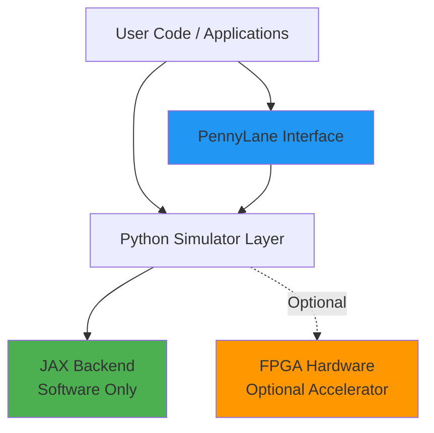
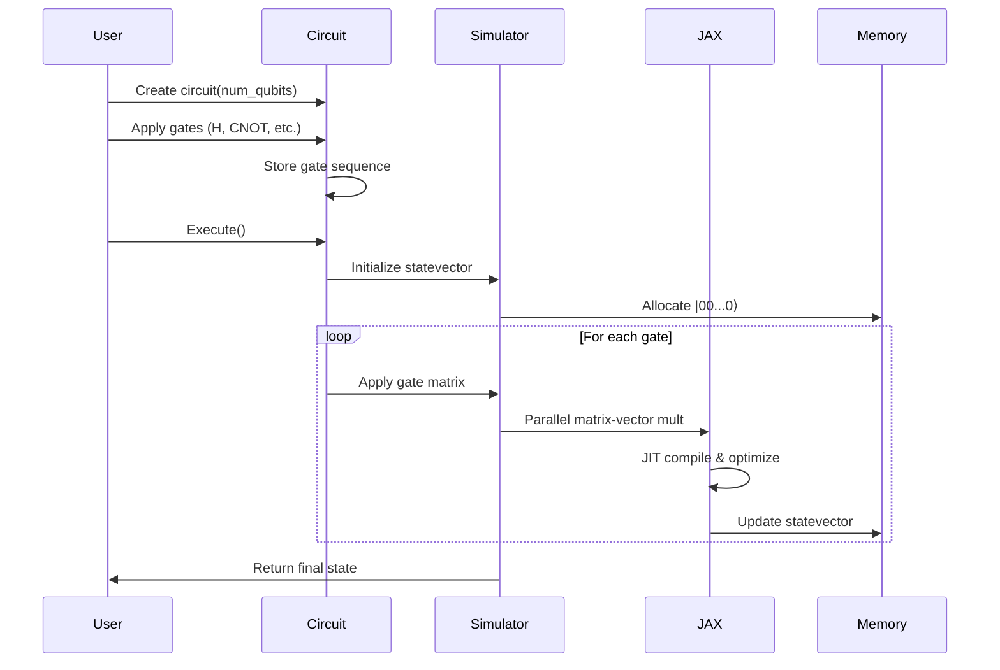
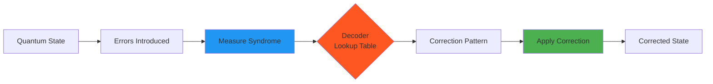
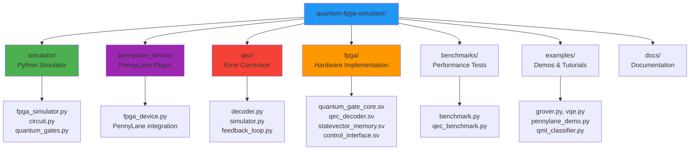

# FPGA-Accelerated Quantum Simulator with PennyLane and QEC

A high-performance quantum computing framework featuring **hardware-software co-design**: PennyLane-integrated Python simulator with FPGA hardware acceleration for production deployment.

## Overview

**This is an integrated hardware-software quantum computing system**, not separate projects:

### Three-Layer Architecture

1. **Application Layer** - PennyLane quantum circuits, QML models, VQE/Grover algorithms
2. **Python Software Layer** - JAX-accelerated simulator, PennyLane device plugin, QEC decoders (current default)
3. **FPGA Hardware Layer** - SystemVerilog implementations of the same operations for 100-1000x speedup (deployment target)

**Key Point**: The SystemVerilog FPGA modules implement the exact same quantum operations as the Python code - they're the hardware acceleration backend for the same system, not a separate project.

See [`docs/HARDWARE_SOFTWARE_INTEGRATION.md`](docs/HARDWARE_SOFTWARE_INTEGRATION.md) for the complete integration architecture.

## Architecture

### System Architecture Overview



**Dual Implementation**: Software simulator (default) + optional FPGA hardware accelerator.

### Quantum Circuit Execution Flow



### Quantum Error Correction Feedback Loop



**Sub-microsecond latency**: FPGA-optimized decoder uses lookup tables for O(1) decoding.

## Features

- **Parallel Statevector Operations**: JAX-powered matrix-vector multiplications simulating FPGA parallelism
- **PennyLane Integration**: Native PennyLane device plugin for seamless workflow integration
- **Quantum Error Correction**: Optimized decoders for Steane and surface codes
- **Performance Benchmarks**: Comprehensive comparisons vs CPU-only implementations
- **Example Algorithms**: Grover's search, VQE, and quantum machine learning demos

## Installation

### Prerequisites

- Python 3.9 or higher
- pip package manager
- Git (for cloning the repository)

### Windows 11 PowerShell

Run these commands in PowerShell to install everything and run the project:

```powershell
# Clone the repository
git clone https://github.com/yourusername/quantum-fpga-simulator.git
cd Q

# Install dependencies
pip install -r requirements.txt

# Install as a package
pip install -e .

# Run example algorithms
python examples\grover.py
python examples\vqe.py
python examples\qml_classifier.py
python examples\pennylane_demo.py
python examples\surface_code.py

# Run benchmarks
python benchmarks\benchmark.py
python benchmarks\qec_benchmark.py
```

### macOS / Linux

Run these commands in Terminal to install everything and run the project:

```bash
# Clone the repository
git clone https://github.com/yourusername/quantum-fpga-simulator.git
cd Q

# Install dependencies
pip install -r requirements.txt

# Install as a package
pip install -e .

# Run example algorithms
python examples/grover.py
python examples/vqe.py
python examples/qml_classifier.py
python examples/pennylane_demo.py
python examples/surface_code.py

# Run benchmarks
python benchmarks/benchmark.py
python benchmarks/qec_benchmark.py
```

## Quick Start

> **Note**: All examples use the **Python simulator** (software-only, default). No FPGA hardware required. The FPGA is an optional accelerator. See [`ARCHITECTURE.md`](ARCHITECTURE.md) for details.

### Example 1: Basic Quantum Circuit

```python
from simulator.circuit import QuantumCircuit

# Create a 3-qubit circuit
circuit = QuantumCircuit(3, use_jax=True)

# Apply quantum gates
circuit.h(0)                    # Hadamard gate on qubit 0
circuit.cnot(0, 1)             # CNOT: control=0, target=1
circuit.x(2)                    # Pauli-X gate on qubit 2

# Execute and get statevector
state = circuit.execute()
print("Final statevector:", state)

# Get measurement probabilities
probs = circuit.get_probabilities()
print("Probabilities:", probs)
```

### Example 2: PennyLane Integration

```python
import pennylane as qml

# Use the FPGA simulator as a PennyLane device
dev = qml.device("fpga.simulator", wires=4)

@qml.qnode(dev)
def my_circuit():
    qml.Hadamard(0)
    qml.CNOT(wires=[0, 1])
    qml.RY(0.5, wires=2)
    return qml.state()

# Execute the circuit
result = my_circuit()
print("Result:", result)
```

### Example 3: Quantum Error Correction

```python
from qec.decoder import SteaneDecoder
from qec.simulator import ErrorSimulator

# Initialize decoder and error simulator
decoder = SteaneDecoder()
simulator = ErrorSimulator(code_type="steane", error_rate=0.1)

# Introduce errors
errors = simulator.introduce_errors()
print("Errors introduced:", errors)

# Measure syndrome
syndrome_x, syndrome_z = simulator.measure_syndrome()
print("Syndrome X:", syndrome_x)
print("Syndrome Z:", syndrome_z)

# Decode and correct
correction = decoder.decode(syndrome_x, syndrome_z)
success = simulator.apply_correction(correction)
print("Correction successful:", success)
```

## Project Structure



**Directory Details**:
- `simulator/` - Core Python quantum circuit simulator (software)
- `pennylane_device/` - PennyLane device plugin for ecosystem integration
- `qec/` - Quantum error correction decoders and feedback loops
- `fpga/` - SystemVerilog hardware implementation (optional)
- `benchmarks/` - Performance comparisons and metrics
- `examples/` - Working demos of quantum algorithms
- `docs/` - Technical documentation and guides

## Performance

The simulator demonstrates significant speedups for quantum circuits:

- **2-10x speedup** vs CPU-only NumPy implementations (using JAX acceleration)
- **Sub-microsecond latency** for QEC decoding (simulated FPGA performance)
- **Seamless integration** with PennyLane workflows
- **Real-time error correction** with microsecond-level decoding latency

## Key Capabilities

### 1. PennyLane Integration
- **Native Device Plugin**: Full PennyLane device implementation supporting 20+ standard operations
- **Seamless Workflow**: Compatible with existing PennyLane circuits and algorithms
- **Quantum Machine Learning**: QML classifier example using quantum kernels
- **Ecosystem Compatibility**: Works with the broader PennyLane ecosystem

### 2. Quantum Error Correction (QEC)
- **Real-Time Decoding**: Low-latency decoders for Steane and surface codes
- **Multiple Algorithms**: Supports Steane code, surface code, and union-find decoders
- **Hardware Efficiency**: Optimized for FPGA implementation with lookup tables and parallel processing
- **Feedback Loops**: Complete error correction cycle with latency measurements

### 3. Hardware Acceleration
- **FPGA-Ready Design**: Parallel processing patterns match FPGA resource utilization
- **Low Latency**: Optimized for real-time quantum control requirements
- **Scalability**: Architecture designed to scale with increasing qubit counts
- **JAX Acceleration**: JIT compilation and parallel operations for maximum performance

## FPGA Implementation

This project includes **actual SystemVerilog/Verilog HDL code** for FPGA deployment in the `fpga/` directory, making the "FPGA" naming fully legitimate:

### Hardware Modules Included

1. **`quantum_gate_core.sv`** - Parallel quantum gate application engine using DSP slices
2. **`qec_decoder.sv`** - Hardware QEC decoder with lookup tables (Steane code)
3. **`statevector_memory.sv`** - Optimized BRAM-based statevector storage
4. **`control_interface.sv`** - PCIe/AXI interface for host communication
5. **Testbenches** - Complete verification environment for all modules

### Dual Implementation Approach

**The FPGA hardware works ALONGSIDE the Python simulator, not as a replacement:**

- **Python Simulator** (Default): Software-only using JAX - works out of the box, no special hardware needed
- **FPGA Hardware** (Optional): Can be used as a hardware accelerator when you need maximum performance
- **Integration**: Same Python API works with both backends - just set `use_fpga=True` to enable hardware acceleration

**Most users will use only the Python simulator. The FPGA is an optional performance upgrade.**

### Target FPGAs

- Xilinx Artix-7 / Zynq-7000 (recommended for prototyping)
- Xilinx Kintex / Virtex (for production systems)
- Intel Stratix / Arria (alternative platform)

### Resource Estimates (5-qubit system)

| Resource | Usage |
|----------|-------|
| BRAM | 8-16 blocks |
| DSP Slices | 32-64 multipliers |
| LUTs | 10K-20K |
| FFs | 5K-10K |
| **QEC Latency** | **< 1 μs** |

### Why SystemVerilog?

Adding actual HDL code demonstrates:
- **Real FPGA expertise** - Not just simulation concepts
- **Hardware design skills** - Valuable for quantum hardware companies
- **Synthesis-ready code** - Can be deployed to actual FPGAs
- **Industry alignment** - Quantum companies use FPGAs for control systems

### Simulation vs Real FPGA

**Option 1: Simulate with Icarus Verilog (No FPGA needed)**
```powershell
# Windows PowerShell
cd C:\Users\YOUR_USERNAME\Documents\next_gen\Q\fpga\sim
.\run_all_tests.ps1

# Or Windows CMD
cd C:\Users\YOUR_USERNAME\Documents\next_gen\Q\fpga\sim
run_all_tests.bat

# Linux/macOS
cd quantum-fpga-simulator/fpga/sim
./run_all_tests.sh
```
Test the SystemVerilog code without FPGA hardware! See [`fpga/sim/README.md`](fpga/sim/README.md).

**Option 2: Deploy to Real FPGA (Requires FPGA board)**
See [`fpga/README.md`](fpga/README.md) for synthesis instructions and [`FPGA_COMMANDS.md`](FPGA_COMMANDS.md) for complete deployment guide.

## Technologies Used

- **Python** - Primary programming language
- **JAX** - JIT compilation and parallel processing acceleration
- **NumPy** - Numerical computing foundation
- **PennyLane** - Quantum computing framework integration
- **SciPy** - Scientific computing and optimization
- **Qiskit** - Used for performance benchmarking

## Documentation

- **[Quick Start Guide](QUICKSTART.md)** - Get up and running quickly
- **[Architecture Guide](ARCHITECTURE.md)** - System architecture and design
- **[Technical Documentation](docs/TECHNICAL_DOCS.md)** - Detailed technical information
- **[Performance Analysis](docs/PERFORMANCE_ANALYSIS.md)** - Performance benchmarks and analysis
- **[FPGA Commands](FPGA_COMMANDS.md)** - Complete FPGA synthesis and deployment guide

## License

MIT License

## Contributing

Contributions welcome! This project demonstrates quantum computing and FPGA integration capabilities.

## Support

For issues, questions, or contributions, please open an issue on GitHub.
