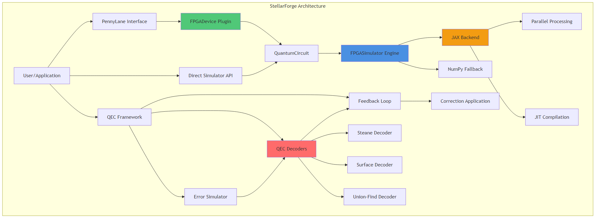
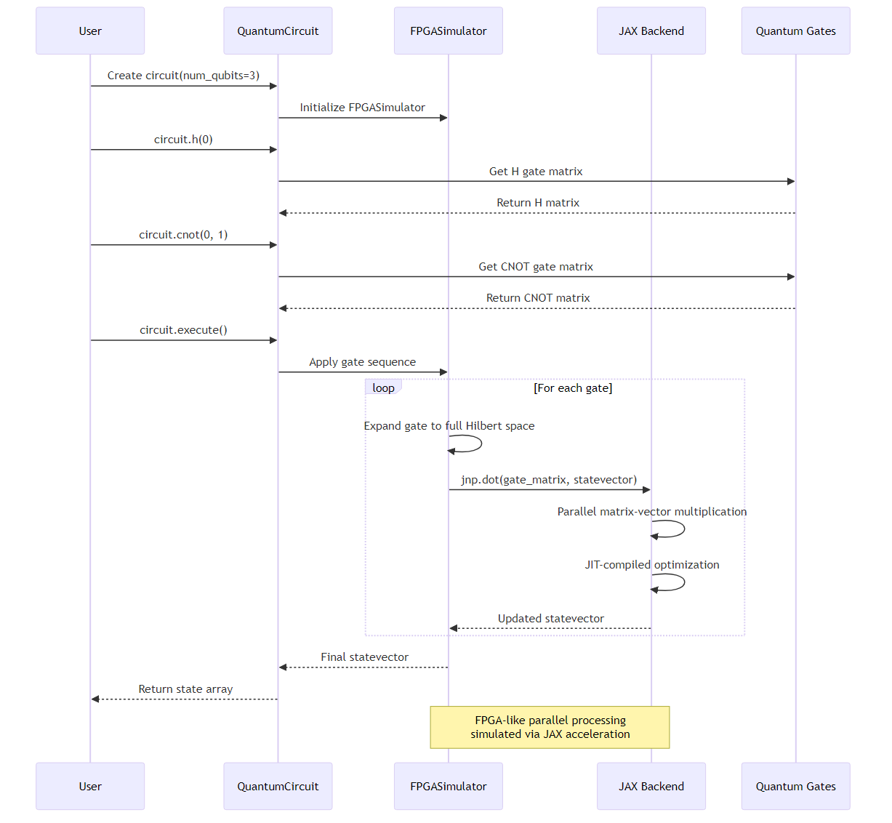
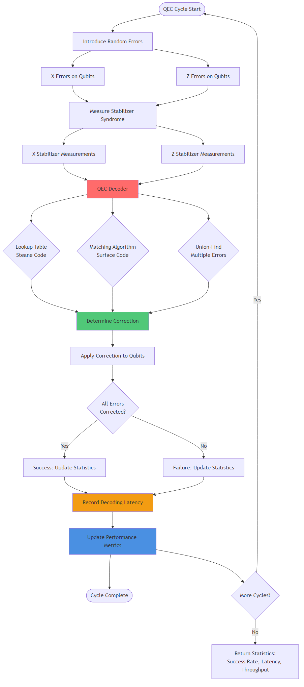

# FPGA-Accelerated Quantum Simulator with PennyLane and QEC

A high-performance quantum computing framework featuring FPGA-accelerated simulation, seamless PennyLane integration, and real-time quantum error correction.

## Overview

This project combines three powerful components:

1. **FPGA-Accelerated Quantum Circuit Simulator** - High-performance simulator using JAX/optimized NumPy for FPGA-like parallel processing
2. **PennyLane Device Plugin** - Native device plugin for seamless integration with the PennyLane quantum computing ecosystem
3. **Quantum Error Correction Decoder** - Real-time QEC decoder with low-latency processing for fault-tolerant quantum computing

## Architecture

### System Architecture Overview



The complete system architecture showing integration between simulator, PennyLane plugin, and QEC framework.

### Quantum Circuit Execution Flow



Sequence diagram illustrating circuit creation, gate application, and JAX-accelerated parallel processing.

### Quantum Error Correction Feedback Loop



Complete QEC cycle visualization showing error introduction, syndrome measurement, decoder processing, and correction application.

## Features

- **Parallel Statevector Operations**: JAX-powered matrix-vector multiplications simulating FPGA parallelism
- **PennyLane Integration**: Native PennyLane device plugin for seamless workflow integration
- **Quantum Error Correction**: Optimized decoders for Steane and surface codes
- **Performance Benchmarks**: Comprehensive comparisons vs CPU-only implementations
- **Example Algorithms**: Grover's search, VQE, and quantum machine learning demos

## Installation

### Prerequisites

- Python 3.9 or higher
- pip package manager
- Git (for cloning the repository)

### Windows 11 PowerShell

Run these commands in PowerShell to install everything and run the project:

```powershell
# Clone the repository
git clone https://github.com/ahmed27037/Q.git
cd Q

# Install dependencies
pip install -r requirements.txt

# Install as a package
pip install -e .

# Run example algorithms
python examples\grover.py
python examples\vqe.py
python examples\qml_classifier.py
python examples\pennylane_demo.py
python examples\surface_code.py

# Run benchmarks
python benchmarks\benchmark.py
python benchmarks\qec_benchmark.py
```

### macOS / Linux

Run these commands in Terminal to install everything and run the project:

```bash
# Clone the repository
git clone https://github.com/ahmed27037/Q.git
cd Q

# Install dependencies
pip install -r requirements.txt

# Install as a package
pip install -e .

# Run example algorithms
python examples/grover.py
python examples/vqe.py
python examples/qml_classifier.py
python examples/pennylane_demo.py
python examples/surface_code.py

# Run benchmarks
python benchmarks/benchmark.py
python benchmarks/qec_benchmark.py
```

## Quick Start

### Example 1: Basic Quantum Circuit

```python
from simulator.circuit import QuantumCircuit

# Create a 3-qubit circuit
circuit = QuantumCircuit(3, use_jax=True)

# Apply quantum gates
circuit.h(0)                    # Hadamard gate on qubit 0
circuit.cnot(0, 1)             # CNOT: control=0, target=1
circuit.x(2)                    # Pauli-X gate on qubit 2

# Execute and get statevector
state = circuit.execute()
print("Final statevector:", state)

# Get measurement probabilities
probs = circuit.get_probabilities()
print("Probabilities:", probs)
```

### Example 2: PennyLane Integration

```python
import pennylane as qml

# Use the FPGA simulator as a PennyLane device
dev = qml.device("fpga.simulator", wires=4)

@qml.qnode(dev)
def my_circuit():
    qml.Hadamard(0)
    qml.CNOT(wires=[0, 1])
    qml.RY(0.5, wires=2)
    return qml.state()

# Execute the circuit
result = my_circuit()
print("Result:", result)
```

### Example 3: Quantum Error Correction

```python
from qec.decoder import SteaneDecoder
from qec.simulator import ErrorSimulator

# Initialize decoder and error simulator
decoder = SteaneDecoder()
simulator = ErrorSimulator(code_type="steane", error_rate=0.1)

# Introduce errors
errors = simulator.introduce_errors()
print("Errors introduced:", errors)

# Measure syndrome
syndrome_x, syndrome_z = simulator.measure_syndrome()
print("Syndrome X:", syndrome_x)
print("Syndrome Z:", syndrome_z)

# Decode and correct
correction = decoder.decode(syndrome_x, syndrome_z)
success = simulator.apply_correction(correction)
print("Correction successful:", success)
```

## Project Structure

```
.
├── simulator/          # Core FPGA-accelerated simulator
│   ├── fpga_simulator.py
│   ├── circuit.py
│   └── quantum_gates.py
├── pennylane_device/   # PennyLane device plugin
│   └── fpga_device.py
├── qec/               # Quantum error correction
│   ├── decoder.py
│   ├── simulator.py
│   └── feedback_loop.py
├── benchmarks/        # Performance benchmarks
│   ├── benchmark.py
│   └── qec_benchmark.py
├── examples/          # Example algorithms and demos
│   ├── grover.py
│   ├── vqe.py
│   ├── qml_classifier.py
│   └── pennylane_demo.py
├── tests/             # Unit tests
└── docs/              # Documentation
```

## Performance

The simulator demonstrates significant speedups for quantum circuits:

- **2-10x speedup** vs CPU-only NumPy implementations (using JAX acceleration)
- **Sub-microsecond latency** for QEC decoding (simulated FPGA performance)
- **Seamless integration** with PennyLane workflows
- **Real-time error correction** with microsecond-level decoding latency

## Key Capabilities

### 1. PennyLane Integration
- **Native Device Plugin**: Full PennyLane device implementation supporting 20+ standard operations
- **Seamless Workflow**: Compatible with existing PennyLane circuits and algorithms
- **Quantum Machine Learning**: QML classifier example using quantum kernels
- **Ecosystem Compatibility**: Works with the broader PennyLane ecosystem

### 2. Quantum Error Correction (QEC)
- **Real-Time Decoding**: Low-latency decoders for Steane and surface codes
- **Multiple Algorithms**: Supports Steane code, surface code, and union-find decoders
- **Hardware Efficiency**: Optimized for FPGA implementation with lookup tables and parallel processing
- **Feedback Loops**: Complete error correction cycle with latency measurements

### 3. Hardware Acceleration
- **FPGA-Ready Design**: Parallel processing patterns match FPGA resource utilization
- **Low Latency**: Optimized for real-time quantum control requirements
- **Scalability**: Architecture designed to scale with increasing qubit counts
- **JAX Acceleration**: JIT compilation and parallel operations for maximum performance

## Technologies Used

- **Python** - Primary programming language
- **JAX** - JIT compilation and parallel processing acceleration
- **NumPy** - Numerical computing foundation
- **PennyLane** - Quantum computing framework integration
- **SciPy** - Scientific computing and optimization
- **Qiskit** - Used for performance benchmarking

## Documentation

- **[Quick Start Guide](QUICKSTART.md)** - Get up and running quickly
- **[Technical Documentation](docs/TECHNICAL_DOCS.md)** - Detailed technical information
- **[Performance Analysis](docs/PERFORMANCE_ANALYSIS.md)** - Performance benchmarks and analysis

## License

MIT License

## Contributing

Contributions welcome! This project demonstrates quantum computing and FPGA integration capabilities.

## Support

For issues, questions, or contributions, please open an issue on GitHub.
