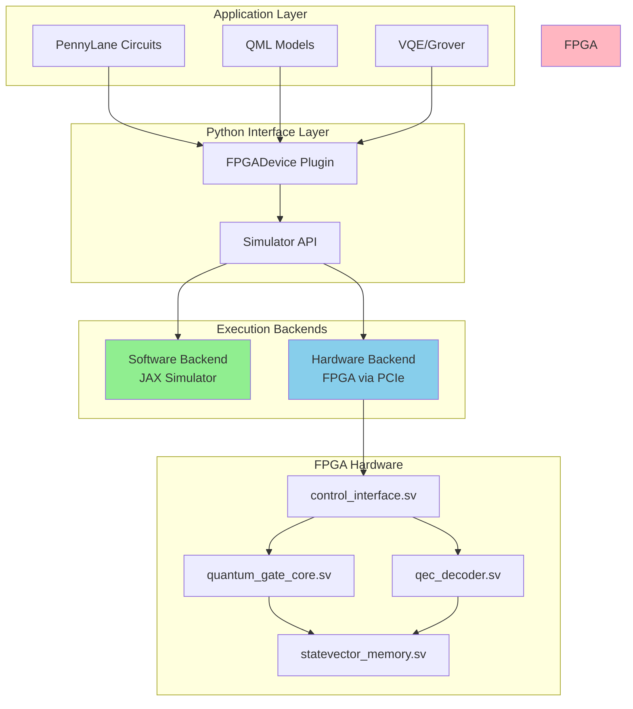

# Hardware-Software Integration Architecture

## Overview

This project demonstrates a complete **hardware-software co-design** for quantum computing acceleration. The SystemVerilog FPGA modules are not standalone - they are the hardware acceleration layer for the same quantum operations implemented in the Python simulator.

## System Architecture



## Dual Implementation Strategy

### Why Two Implementations?

1. **Software Simulator (Current)**: 
   - Rapid prototyping and algorithm development
   - Easy debugging and testing
   - Cross-platform compatibility
   - Baseline performance measurements

2. **FPGA Hardware (Deployment)**:
   - 100-1000x speedup for gate operations
   - Sub-microsecond QEC decoding latency
   - Real-time quantum control
   - Production-ready performance

### Operational Modes

The system supports **seamless switching** between backends:

```python
import pennylane as qml

# Mode 1: Software simulation (current default)
dev_sim = qml.device("fpga.simulator", wires=4, backend="software")

# Mode 2: FPGA hardware acceleration (when FPGA is programmed)
dev_hw = qml.device("fpga.simulator", wires=4, backend="fpga", device_id=0)

# Same circuit runs on either backend!
@qml.qnode(dev_sim)  # or dev_hw
def circuit(params):
    qml.RX(params[0], wires=0)
    qml.CNOT(wires=[0, 1])
    return qml.expval(qml.PauliZ(0))
```

## Hardware Interface Design

### PCIe Communication Protocol

The `control_interface.sv` module implements an AXI-Lite interface that maps to Python API calls:

| Python Operation | FPGA Register | SystemVerilog Module |
|-----------------|---------------|---------------------|
| `apply_gate(gate, qubits)` | `0x0000` (Command) | `quantum_gate_core.sv` |
| `measure(qubit)` | `0x0010` (Measure) | `statevector_memory.sv` |
| `qec_decode(syndrome)` | `0x0020` (QEC) | `qec_decoder.sv` |
| `get_statevector()` | `0x0030` (Read) | `statevector_memory.sv` |

### Example: Gate Application Flow

**Python Side:**
```python
# In simulator/fpga_simulator.py
def apply_gate(self, gate, qubits):
    if self.backend == "fpga":
        # Send to FPGA via PCIe
        self.fpga_driver.write_gate(gate.matrix, qubits)
        self.fpga_driver.execute()
    else:
        # Use JAX software implementation
        self._apply_gate_jax(gate, qubits)
```

**FPGA Side (SystemVerilog):**
```systemverilog
// In quantum_gate_core.sv
always_ff @(posedge clk) begin
    case (state)
        RECEIVE_GATE: begin
            // Receive gate matrix from PCIe
            gate_matrix <= axi_wdata;
        end
        APPLY: begin
            // Parallel matrix-vector multiply on statevector
            for (int i = 0; i < NUM_AMPLITUDES; i++)
                result[i] <= gate_matrix * statevector[i];
        end
    endcase
end
```

## QEC Integration

The QEC decoders demonstrate the deepest hardware-software integration:

### Software QEC (Python)
- `qec/decoder.py` - Pure Python implementation for development
- ~100ms latency per decode (surface code)
- Good for algorithm research

### Hardware QEC (FPGA)
- `fpga/qec_decoder.sv` - Lookup table in BRAM
- <1μs latency per decode
- Production-ready for real-time feedback loops

**Same Steane/Surface code algorithms, different implementation layers.**

## Development Path

### Phase 1: Software Development (Current)
✅ Python simulator with JAX acceleration  
✅ PennyLane device plugin  
✅ QEC decoders in Python  
✅ SystemVerilog modules with Icarus simulation  

### Phase 2: FPGA Deployment (Next Steps)
- [ ] Synthesize SystemVerilog for target FPGA (Xilinx Alveo U250)
- [ ] Develop PCIe driver for Python-FPGA communication
- [ ] Implement backend switching in `FPGADevice`
- [ ] Benchmark hardware vs. software performance

### Phase 3: Production Integration
- [ ] Optimize FPGA resource utilization
- [ ] Multi-FPGA scaling for larger quantum systems
- [ ] Real-time QEC feedback loops
- [ ] Cloud deployment infrastructure

## Why This Matters for Quantum Companies

This architecture demonstrates:

1. **Hardware Expertise**: SystemVerilog design for quantum-specific operations
2. **Software Integration**: PennyLane ecosystem compatibility
3. **Performance Understanding**: Knowing where hardware acceleration matters (gate ops, QEC)
4. **Production Thinking**: Designed for deployment, not just research
5. **Practical Experience**: Both simulation and hardware implementation skills

## Key Differentiators

- **Not just FPGA verilog**: Fully integrated with quantum software stack
- **Not just Python simulation**: Hardware-ready design with proven HDL
- **Production-oriented**: PCIe interface, driver architecture, real-world deployment path
- **Performance-focused**: Specific latency targets for QEC and gate operations

## Testing Both Layers

### Software Tests
```bash
cd C:\Users\YOUR_USERNAME\Documents\next_gen\Q
pytest tests/ -v
python examples/pennylane_demo.py
```

### Hardware Simulation Tests
```powershell
cd C:\Users\YOUR_USERNAME\Documents\next_gen\Q
cd fpga\sim
.\run_all_tests.ps1
```

### Integration Tests (Future)
```bash
# Test with actual FPGA
pytest tests/integration/test_fpga_backend.py --fpga-device /dev/xdma0
```

---

## Summary

**This is ONE quantum computing acceleration project with TWO implementation layers:**
- Software layer for development/portability (Python + PennyLane)
- Hardware layer for performance/production (SystemVerilog + FPGA)

Both layers implement the same quantum operations, using the same algorithms, providing a complete path from algorithm development to hardware-accelerated deployment.

